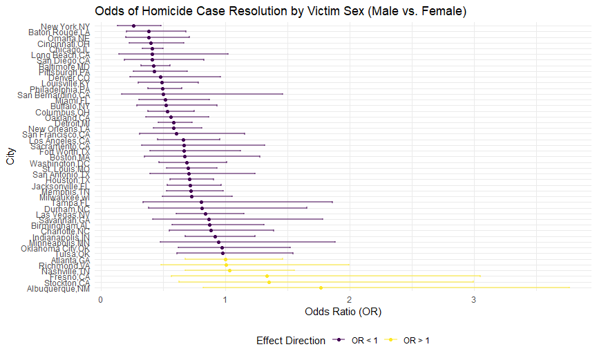
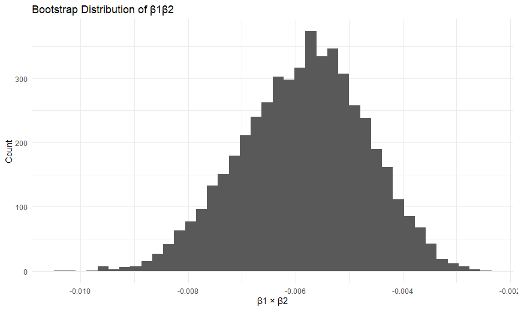
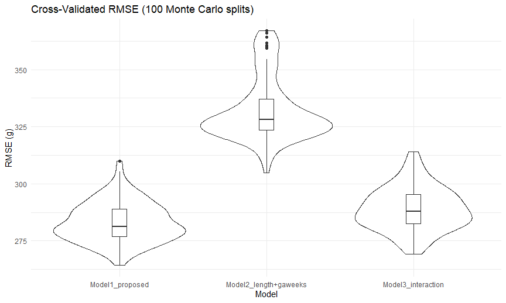

p8105_hw6
================
Jicong Zhang
2025-12-02

# Problem 1

``` r
homi_df = 
  read.csv("./homicide-data.csv",na = c("NA", ".", "")) %>%
  janitor::clean_names()
```

``` r
dis_df = homi_df %>%
  mutate(city_state = str_c(city, state, sep = ",")) %>%
  select(-city) %>%
  select(-state) %>%
  mutate(solved = if_else(disposition == "Closed by arrest", 1, 0),
         victim_age = as.numeric(victim_age)) %>%
  filter(!city_state %in% c("Dallas,TX", "Phoenix,AZ", "Kansas City,MO", "Tulsa,AL")) %>%
  filter(victim_race %in% c("White", "Black"))
```

    ## Warning: There was 1 warning in `mutate()`.
    ## ℹ In argument: `victim_age = as.numeric(victim_age)`.
    ## Caused by warning:
    ## ! 强制改变过程中产生了NA

``` r
dis_df %>%
  glimpse()
```

    ## Rows: 39,693
    ## Columns: 12
    ## $ uid           <chr> "Alb-000003", "Alb-000005", "Alb-000006", "Alb-000009", …
    ## $ reported_date <int> 20100601, 20100102, 20100126, 20100130, 20100218, 201003…
    ## $ victim_last   <chr> "SATTERFIELD", "MULA", "BOOK", "MARTIN-LEYVA", "LUJAN", …
    ## $ victim_first  <chr> "VIVIANA", "VIVIAN", "GERALDINE", "GUSTAVO", "KEVIN", "S…
    ## $ victim_race   <chr> "White", "White", "White", "White", "White", "White", "W…
    ## $ victim_age    <dbl> 15, 72, 91, 56, NA, 43, 52, 22, 15, 25, 20, 88, 36, 47, …
    ## $ victim_sex    <chr> "Female", "Female", "Female", "Male", "Male", "Female", …
    ## $ lat           <dbl> 35.08609, 35.13036, 35.15111, 35.07538, 35.07701, 35.070…
    ## $ lon           <dbl> -106.6956, -106.5810, -106.5378, -106.5535, -106.5649, -…
    ## $ disposition   <chr> "Closed without arrest", "Closed without arrest", "Open/…
    ## $ city_state    <chr> "Albuquerque,NM", "Albuquerque,NM", "Albuquerque,NM", "A…
    ## $ solved        <dbl> 0, 0, 0, 0, 0, 1, 1, 1, 1, 1, 1, 0, 0, 0, 1, 1, 1, 1, 1,…

**After omit some cities and focus on race of white and black, there are
39693 victims that have the homicide been solved.**

``` r
baltimore = dis_df %>%
  filter(city_state == "Baltimore,MD")
```

``` r
bal_fit = baltimore %>%
  glm(solved~victim_age + victim_sex + victim_race, data=., family = binomial(link="logit"))
bal_fit %>%
  broom::tidy(conf.int = TRUE) %>%
  filter(term == "victim_sexMale") %>%
  mutate(OR = exp(estimate),
         OR_lower = exp(conf.low),
         OR_higher = exp(conf.high)) %>%
  select(term, log_estimate = OR, OR_lower, OR_higher) %>%
  knitr::kable(digits = 3)
```

| term           | log_estimate | OR_lower | OR_higher |
|:---------------|-------------:|---------:|----------:|
| victim_sexMale |        0.426 |    0.324 |     0.558 |

``` r
bal_fit
```

    ## 
    ## Call:  glm(formula = solved ~ victim_age + victim_sex + victim_race, 
    ##     family = binomial(link = "logit"), data = .)
    ## 
    ## Coefficients:
    ##      (Intercept)        victim_age    victim_sexMale  victim_raceWhite  
    ##         0.309981         -0.006727         -0.854463          0.841756  
    ## 
    ## Degrees of Freedom: 2752 Total (i.e. Null);  2749 Residual
    ## Null Deviance:       3568 
    ## Residual Deviance: 3493  AIC: 3501

``` r
fit_logistic = dis_df %>% 
  select(city_state, solved, victim_age, victim_race, victim_sex) %>% 
  nest(data = -city_state) %>%
  mutate(models = map(data, \(df)glm(solved ~ victim_age + victim_race + victim_sex,family = binomial(), data = df)),
         results = map(models, \(mod)broom::tidy(mod, conf.int = TRUE))) %>%
  select(-models, -data) %>%
  unnest(results)
```

    ## Warning: There were 45 warnings in `mutate()`.
    ## The first warning was:
    ## ℹ In argument: `results = map(models, function(mod) broom::tidy(mod, conf.int =
    ##   TRUE))`.
    ## Caused by warning:
    ## ! glm.fit:拟合概率算出来是数值零或一
    ## ℹ Run `dplyr::last_dplyr_warnings()` to see the 44 remaining warnings.

``` r
fit_logistic2 = 
  fit_logistic %>% 
  filter(str_detect(term, "Male")) %>%
  group_by(city_state) %>%
  mutate(OR = exp(estimate),
         OR_lower = exp(conf.low),
         OR_higher = exp(conf.high)) %>%
  select(city_state, OR, OR_lower, OR_higher)

fit_logistic2 %>%
  knitr::kable()
```

| city_state        |        OR |  OR_lower | OR_higher |
|:------------------|----------:|----------:|----------:|
| Albuquerque,NM    | 1.7674995 | 0.8247081 | 3.7618600 |
| Atlanta,GA        | 1.0000771 | 0.6803477 | 1.4582575 |
| Baltimore,MD      | 0.4255117 | 0.3241908 | 0.5575508 |
| Baton Rouge,LA    | 0.3814393 | 0.2043481 | 0.6836343 |
| Birmingham,AL     | 0.8700153 | 0.5713814 | 1.3138409 |
| Boston,MA         | 0.6739912 | 0.3534469 | 1.2768225 |
| Buffalo,NY        | 0.5205704 | 0.2884416 | 0.9358300 |
| Charlotte,NC      | 0.8838976 | 0.5507440 | 1.3905954 |
| Chicago,IL        | 0.4100982 | 0.3361233 | 0.5008546 |
| Cincinnati,OH     | 0.3998277 | 0.2313767 | 0.6670456 |
| Columbus,OH       | 0.5324845 | 0.3770457 | 0.7479124 |
| Denver,CO         | 0.4790620 | 0.2327380 | 0.9624974 |
| Detroit,MI        | 0.5823472 | 0.4619454 | 0.7335458 |
| Durham,NC         | 0.8123514 | 0.3824420 | 1.6580169 |
| Fort Worth,TX     | 0.6689803 | 0.3935128 | 1.1211603 |
| Fresno,CA         | 1.3351647 | 0.5672553 | 3.0475080 |
| Houston,TX        | 0.7110264 | 0.5569844 | 0.9057376 |
| Indianapolis,IN   | 0.9187284 | 0.6784616 | 1.2413059 |
| Jacksonville,FL   | 0.7198144 | 0.5359236 | 0.9650986 |
| Las Vegas,NV      | 0.8373078 | 0.6058830 | 1.1510854 |
| Long Beach,CA     | 0.4102163 | 0.1427304 | 1.0241775 |
| Los Angeles,CA    | 0.6618816 | 0.4565014 | 0.9541036 |
| Louisville,KY     | 0.4905546 | 0.3014879 | 0.7836391 |
| Memphis,TN        | 0.7232194 | 0.5261210 | 0.9835973 |
| Miami,FL          | 0.5152379 | 0.3040214 | 0.8734480 |
| Milwaukee,wI      | 0.7271327 | 0.4951325 | 1.0542297 |
| Minneapolis,MN    | 0.9469587 | 0.4759016 | 1.8809745 |
| Nashville,TN      | 1.0342379 | 0.6807452 | 1.5559966 |
| New Orleans,LA    | 0.5849373 | 0.4218807 | 0.8121787 |
| New York,NY       | 0.2623978 | 0.1327512 | 0.4850117 |
| Oakland,CA        | 0.5630819 | 0.3637421 | 0.8671086 |
| Oklahoma City,OK  | 0.9740747 | 0.6228507 | 1.5199721 |
| Omaha,NE          | 0.3824861 | 0.1988357 | 0.7109316 |
| Philadelphia,PA   | 0.4962756 | 0.3760120 | 0.6498797 |
| Pittsburgh,PA     | 0.4307528 | 0.2626022 | 0.6955518 |
| Richmond,VA       | 1.0060520 | 0.4834671 | 1.9936248 |
| San Antonio,TX    | 0.7046200 | 0.3928179 | 1.2382509 |
| Sacramento,CA     | 0.6688418 | 0.3262733 | 1.3143888 |
| Savannah,GA       | 0.8669817 | 0.4185827 | 1.7802453 |
| San Bernardino,CA | 0.5003444 | 0.1655367 | 1.4623977 |
| San Diego,CA      | 0.4130248 | 0.1913527 | 0.8301847 |
| San Francisco,CA  | 0.6075362 | 0.3116925 | 1.1551470 |
| St. Louis,MO      | 0.7031665 | 0.5298505 | 0.9319005 |
| Stockton,CA       | 1.3517273 | 0.6256427 | 2.9941299 |
| Tampa,FL          | 0.8077029 | 0.3395253 | 1.8598834 |
| Tulsa,OK          | 0.9757694 | 0.6090664 | 1.5439356 |
| Washington,DC     | 0.6901713 | 0.4653608 | 1.0122516 |

``` r
fit_logistic_plot = fit_logistic2 %>%
  ggplot(aes(x = fct_reorder(city_state, OR, .desc = TRUE),
             y = OR,
             ymin = OR_lower,
             ymax = OR_higher,
             color = ifelse(OR > 1, "OR > 1", "OR < 1"))) +
  geom_errorbar(width = 0.3,
                linewidth = 0.8,
                alpha = 0.5) +
  geom_point() +
  coord_flip() +
  labs(
    x = "City",
    y = "Odds Ratio (OR)",
    title = "Odds of Homicide Case Resolution by Victim Sex (Male vs. Female)",
    color = "Effect Direction"
  )
fit_logistic_plot
```



**The ranking reveals that most U.S. cities have lower homicide
resolution rates for male victims, though the magnitude is modest in
many places. Only a few cities show higher resolution rates for male
victims. The plot efficiently highlights geographic variability in
sex-related disparities in homicide case resolution.**

# Problem 2

``` r
library(p8105.datasets)
data("weather_df")
form = tmax ~ tmin + prcp
B = 5000

boot_df =
  tibble(
    boot_id = 1:B,
    boot_sample = map(boot_id, ~ sample_frac(weather_df, replace = TRUE))
  ) %>%
  mutate(
    fit = map(boot_sample, ~ lm(form, data = .x)),
    glance = map(fit, glance),            
    tidy = map(fit, tidy)                 
  ) %>%
  mutate(
    r2 = map_dbl(glance, "r.squared"),

    beta_product = map_dbl(
      tidy,
      ~ {
        b1 = .x %>% filter(term == "tmin") %>% pull(estimate)
        b2 = .x %>% filter(term == "prcp") %>% pull(estimate)
        b1 * b2
      }
    )
  ) %>%
  select(boot_id, r2, beta_product)
```

``` r
boot_df %>%
  ggplot(aes(x = r2)) +
  geom_histogram(bins = 40) +
  theme_minimal() +
  labs(
    title = "Bootstrap Distribution of R-squared",
    x = "r^2",
    y = "Count"
  )
```



``` r
boot_df %>%
  ggplot(aes(x = beta_product)) +
  geom_histogram(bins = 40) +
  theme_minimal() +
  labs(
    title = "Bootstrap Distribution of β1β2",
    x = "β1 × β2",
    y = "Count"
  )
```


``` r
quantile(boot_df$r2, c(0.025, 0.975))
```

    ##      2.5%     97.5% 
    ## 0.9343767 0.9466277

``` r
quantile(boot_df$beta_product, c(0.025, 0.975))
```

    ##         2.5%        97.5% 
    ## -0.008206450 -0.003711344

**The 95% confidence interval for r^2 is (0.9343,0.9466). The 95%
confidence interval for beta1/beta2 is (-0.0092,-0.0037)**

# Problem 3

``` r
bw_df = 
  read.csv("./birthweight.csv",na = c("NA", ".", "")) %>%
  janitor::clean_names() %>%
  mutate(
    babysex = factor(babysex, levels = c(1, 2), labels = c("male", "female")),
    frace = factor(frace, levels = c(1,2,3,4,8,9),
                   labels = c("white","black","asian","puerto_rican","other","unknown")),
    mrace = factor(mrace, levels = c(1,2,3,4,8),
                   labels = c("white","black","asian","puerto_rican","other")),
    malform = factor(malform, levels = c(0, 1), labels = c("absent", "present")),
    parity = as.integer(parity)
  )
```

``` r
model_bw = lm(
  bwt ~ bhead + blength + gaweeks + ppbmi + mheight + momage + smoken,
  data = bw_df
)
model_bw
```

    ## 
    ## Call:
    ## lm(formula = bwt ~ bhead + blength + gaweeks + ppbmi + mheight + 
    ##     momage + smoken, data = bw_df)
    ## 
    ## Coefficients:
    ## (Intercept)        bhead      blength      gaweeks        ppbmi      mheight  
    ##   -7020.309      136.347       79.123       14.552        4.371       13.389  
    ##      momage       smoken  
    ##       5.031       -2.440

``` r
summary(model_bw)
```

    ## 
    ## Call:
    ## lm(formula = bwt ~ bhead + blength + gaweeks + ppbmi + mheight + 
    ##     momage + smoken, data = bw_df)
    ## 
    ## Residuals:
    ##      Min       1Q   Median       3Q      Max 
    ## -1158.63  -184.42    -7.33   176.95  2488.74 
    ## 
    ## Coefficients:
    ##               Estimate Std. Error t value Pr(>|t|)    
    ## (Intercept) -7020.3093   134.8295 -52.068  < 2e-16 ***
    ## bhead         136.3470     3.5014  38.941  < 2e-16 ***
    ## blength        79.1233     2.0771  38.093  < 2e-16 ***
    ## gaweeks        14.5515     1.4985   9.711  < 2e-16 ***
    ## ppbmi           4.3713     1.3683   3.195  0.00141 ** 
    ## mheight        13.3886     1.6609   8.061 9.71e-16 ***
    ## momage          5.0306     1.1286   4.457 8.51e-06 ***
    ## smoken         -2.4396     0.5851  -4.170 3.11e-05 ***
    ## ---
    ## Signif. codes:  0 '***' 0.001 '**' 0.01 '*' 0.05 '.' 0.1 ' ' 1
    ## 
    ## Residual standard error: 282.7 on 4334 degrees of freedom
    ## Multiple R-squared:  0.6958, Adjusted R-squared:  0.6953 
    ## F-statistic:  1416 on 7 and 4334 DF,  p-value: < 2.2e-16

``` r
bw_df_plot = bw_df %>%
  add_predictions(model_bw) %>%
  add_residuals(model_bw) %>%
  ggplot(aes(x = pred, y = resid)) +
  geom_point(alpha = 0.3) +
  geom_smooth(se = FALSE, color = "red") +
  labs(
    title = "Residuals vs Fitted Values",
    x = "Fitted values (predicted birthweight)",
    y = "Residuals"
  )
bw_df_plot
```

    ## `geom_smooth()` using method = 'gam' and formula = 'y ~ s(x, bs = "cs")'



**To develop a regression model for birthweight, I used a combination of
subject-matter reasoning and data-driven exploration. In this way my
model is:
bw=β0+β1bhead+β2blength+β3gaweeks+β4ppbmi+β5mheight+β6momage+β7smoken+ε.
According to the plot, residuals are centered around zero across the
fitted-value range, indicating no major structural bias. There is no
strong curvature, suggesting the linearity assumption is reasonable. The
spread of residuals increases somewhat at higher fitted values, which is
common in birthweight data and indicates mild heteroscedasticity. There
are also some outliers, but they do not dominate the model.**

``` r
cv_df = crossv_mc(bw_df, 100) %>%
  mutate(
    train = map(train, as_tibble),
    test  = map(test,  as_tibble)
  )

cv_df = cv_df %>%
  mutate(
    mod1 = map(train, ~ lm(bwt ~ bhead + blength + gaweeks + ppbmi +
                             mheight + momage + smoken,
                           data = .x)),
    mod2 = map(train, ~ lm(bwt ~ blength + gaweeks, data = .x)),
    mod3 = map(train, ~ lm(bwt ~ bhead * blength * babysex, data = .x))
  ) %>%
  mutate(
    rmse1 = map2_dbl(mod1, test,  ~ rmse(.x, .y)),
    rmse2 = map2_dbl(mod2, test,  ~ rmse(.x, .y)),
    rmse3 = map2_dbl(mod3, test,  ~ rmse(.x, .y))
  )

cv_summary = cv_df %>%
  summarise(
    mean_rmse1 = mean(rmse1),  sd_rmse1 = sd(rmse1),
    mean_rmse2 = mean(rmse2),  sd_rmse2 = sd(rmse2),
    mean_rmse3 = mean(rmse3),  sd_rmse3 = sd(rmse3)
  )

print(cv_summary)
```

    ## # A tibble: 1 × 6
    ##   mean_rmse1 sd_rmse1 mean_rmse2 sd_rmse2 mean_rmse3 sd_rmse3
    ##        <dbl>    <dbl>      <dbl>    <dbl>      <dbl>    <dbl>
    ## 1       283.     8.68       332.     13.9       289.     9.48

``` r
cv_df %>%
  select(rmse1, rmse2, rmse3) %>%
  pivot_longer(everything(),
               names_to = "model",
               values_to = "rmse",
               names_prefix = "rmse") %>%
  mutate(model = case_when(
    model == "1" ~ "Model1_proposed",
    model == "2" ~ "Model2_length+gaweeks",
    model == "3" ~ "Model3_interaction"
  )) %>%
  ggplot(aes(x = model, y = rmse)) +
    geom_violin(trim = TRUE) +
    geom_boxplot(width = 0.1) +
    labs(title = "Cross-Validated RMSE (100 Monte Carlo splits)",
         y = "RMSE (g)", x = "Model")
```


**According to the plot, Model 1 has the best predictive performance,
with the lowest and most stable RMSE across 100 cross-validated splits.
Model 3 performs reasonably but is not better than the simpler Model 1.
Model 2 clearly underperforms, confirming that length and gestational
age alone are insufficient predictors.**
